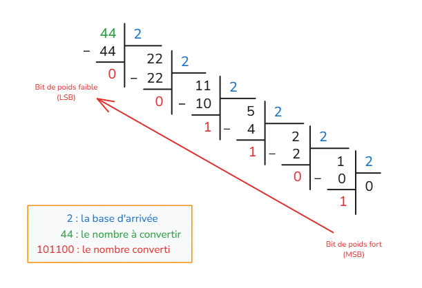
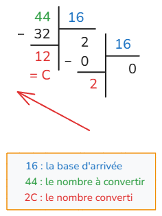

:::info

## 📈 Objectifs du cours

- Savoir **convertir** un entier entre les bases 2, 10 et 16
- Comprendre les **liens entre ces systèmes**
- Identifier les **cas pratiques** en informatique

:::

---

## Représentation des entiers positifs

### Le système décimal (base 10)

En effet, tout le monde sait compter en base 10 (décimal). Mais comment ça marche ? Comment est construit notre système ? Pour répondre à cette question à l'apparence simple, oubliez tout et reprenons depuis le début : comment avez-vous appris à compter à l'école ?

Vous penserez peut-être que la base 10 vient du fait qu'on a 10 doigts, mais en tout cas deux choses sont sûres :

- Il y a 10 chiffres : 0, 1, 2, 3, 4, 5, 6, 7, 8, 9.
- Avec ces derniers, on peut compter jusqu'à 9.

Et si l'on veut aller au-delà de 9, il faut changer de rang.

Cela signifie que si le rang des unités est plein, il faut passer à celui des dizaines, puis des centaines, milliers et j'en passe.

Par exemple, le nombre 1234 se décompose comme suit :

4 unités, 3 dizaines, 2 centaines et 1 millier.

On peut alors l'écrire comme suit :

$$
\begin{aligned}
1234 &= 1000 + 200 + 30 + 4 \\
1234 &= 1 \times 10^3 + 2 \times 10^2 + 3 \times 10^1 + 4 \times 10^0
\end{aligned}
$$

### Le système binaire (base 2)

- Le système binaire est la base la plus simple.
- Il utilise donc seulement deux chiffres, 0 et 1, appelés bits (contraction de l'anglais *binary digit*).
- 8 bits forment un octet, qui peut représenter 256 valeurs différentes (de 0 à 255).
- Avec $n$ bits, on peut représenter $2^n$ valeurs différentes (de 0 à $2^n - 1$).

:::info Utilisations
- Système de comptage des ordinateurs.
- Représentation du fonctionnement de l'électronique numérique (0 = éteint, 1 = allumé).
- Représentation de la vérité d'une proposition logique (0 = faux, 1 = vrai).
:::

### Le système hexadécimal (base 16)

- Le système hexadécimal est un système de numération en base 16.
- Il utilise donc 16 chiffres, 0 à 9 et A à F.
- Plus court que le binaire, mais plus long que le décimal.

:::info Utilisations
-  Encodage des couleurs en informatique (ex : #FF5733).
- Représentation des adresses mémoire (ex : 0x1A3F).
- Utilisé dans les langages de programmation pour représenter des valeurs binaires de manière plus lisible.
:::
## 📊 Méthode de conversion

### ♻️ Décimal ➜ Binaire / Hexa : division par la base

On divise régulièrement par la base, en prenant les **restes** :

> Exemple : 44 en binaire



> Exemple : 44 en hexadécimal




### ♻️ Binaire / Hexa ➜ Décimal : multiplication positionnelle

> Exemple : $101100_2$

$$
\begin{aligned}
&= \textcolor{red}{1} \times 2^5 + \textcolor{red}{0} \times 2^4 + \textcolor{red}{1} \times 2^3 + \textcolor{red}{1} \times 2^2 + \textcolor{red}{0} \times 2^1 + \textcolor{red}{0} \times 2^0 \\
&= 32 + 0 + 8 + 4 + 0 + 0 = 44_{10}
\end{aligned}
$$

> Exemple : $2C_{16}$

***C** se traduit par **12** en décimal*  

$$
\begin{aligned}
&= \textcolor{red}{2} \times 16^1 + \textcolor{red}{12} \times 16^0 \\
&= 32 + 12 = 44_{10}
\end{aligned}
$$

---

## 🔬 Astuce entre binaire et hexadécimal

> 1 chiffre hexa = 4 bits (car $2^4 = 16$)  
> Exemple :

| Binaire | Hexa |
| ------- | ---- |
| 0000    | 0    |
| 0001    | 1    |
| 1010    | A    |
| 1111    | F    |

Pour convertir rapidement :

- Groupes de 4 bits ➜ 1 chiffre hexa
- Inversement, chaque hexa ➜ 4 bits

---

## 💪 Entraînement interactif

import { ConvertIntTrainer } from '@site/src/components/Markdown/BaseConverter/ConvertIntTrainer';

<ConvertIntTrainer fromBase='décimale' toBaseChoice='binaire' />

<ConvertIntTrainer fromBase='décimale' toBaseChoice='hexadécimale' />

<ConvertIntTrainer fromBase='binaire' toBaseChoice='décimale' /> 

<ConvertIntTrainer fromBase='hexadécimale' toBaseChoice='décimale' /> 

---

## 📖 Entraînement

:::note Exercice 1
Produis la table de conversion de base 10 vers base 2 pour les entiers de 1 à 15.
:::

:::note Exercice 2
Combien de bits sont nécéssaires pour représenter les nombres suivants en binaire ?  
**⚠️ Je ne demande pas la conversion de ces nombres** 

- $256_{10}$
- $10_{10}$
- $485_{10}$
- $2028_{10}$
- $1023_{10}$

Et pour les représenter en hexadécimal ?
:::

:::note Exercice 3
Complête la fonction suivante afin qu'elle convertisse un entier positif en binaire **sans** utiliser la fonction `bin()`.

```python
def int_to_binary(n: int) -> str:
    if n == 0:
        return ...
    binary = ""
    while n > 0:
        binary = ...
        n = ...
    return binary
``` 

Ecris une nouvelle fonction qui convertit un entier positif en hexadécimal **sans** utiliser la fonction `hex()`.

```python
def int_to_hex(n: int) -> str:
    if n == 0:
        return ...
    hexa = "" 
    hex_chars = "0123456789ABCDEF"
    while n > 0:
        remainder = ...
        hexa = ...
        n = ...
    return hexa
``` 

:::

## 🔗 Liens utiles

- [Binary Numbers and Base Systems as Fast as Possible](https://www.youtube.com/watch?v=LpuPe81bc2w)
- [Système binaire](https://fr.wikipedia.org/wiki/Syst%C3%A8me_binaire)

## Pour aller plus loin

- Ecrire un programme qui convertit un entier en binaire et en hexadécimal.
- Ecire une fonction qui convertir un entier en [octal](https://fr.wikipedia.org/wiki/Syst%C3%A8me_octal) (base 8).